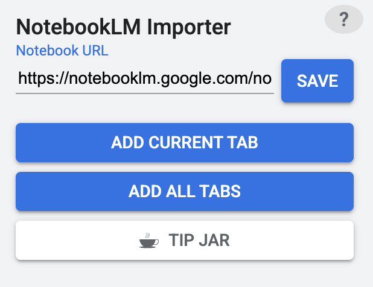

# NotebookLM Importer

A simple Chrome extension to quickly add websites as sources to your Google NotebookLM notebooks.

## Features

-   **One-Click Sourcing**: Add your current browser tab to NotebookLM with a single click.
-   **Bulk Adding**: Add all of your open tabs to NotebookLM at once.
-   **Simple Setup**: Just save your Notebook URL once, and you're ready to go.
-   **Polished UI**: A clean, Material Design-inspired interface that feels right at home in Chrome.
-   **Clear Feedback**: The extension provides visual feedback (loading spinners, success checkmarks, and failure icons) so you always know what's happening.
-   **Built-in Help**: A simple help guide to get you started.

## Installation

Since this extension is not on the Chrome Web Store, you can load it manually in Developer Mode.

1. **Download**: Download the extension files and unzip them into a folder on your computer.
2. **Open Chrome Extensions**: Open Google Chrome and navigate to `chrome://extensions`.
3. **Enable Developer Mode**: In the top right corner of the extensions page, toggle on "Developer mode".
4. **Load the Extension**: Click the "Load unpacked" button that appears, and select the folder where you unzipped the extension files.
5. The **NotebookLM Importer** icon should now appear in your Chrome toolbar. You may need to click the puzzle piece icon to pin it.

## How to Use

First, you need to tell the extension which notebook to add sources to.

1. **Open your notebook** in a browser tab. The URL should look something like `https://notebooklm.google.com/notebook/....`
2. **Copy the URL** of your notebook.
3. **Click the extension icon** in your toolbar to open the popup.
4. **Paste the URL** into the "Notebook URL" box and click **Save**. This is a one-time setup for each notebook you want to use.

Once set up, you can add websites:

-   **To add a single website**: Navigate to the page you want to add, then click **Add Current Tab** in the extension popup.
-   **To add all open websites**: Click **Add All Tabs**. The extension will automatically gather all your open, valid websites and add them in one batch.

## Support the Project

If you find this extension useful, please consider supporting its development!

Or, use the **Tip Jar** button inside the extension.

---

_Disclaimer: This extension relies on the structure of the NotebookLM web page. If the NotebookLM interface is significantly updated, the extension may require updates to continue functioning correctly._
